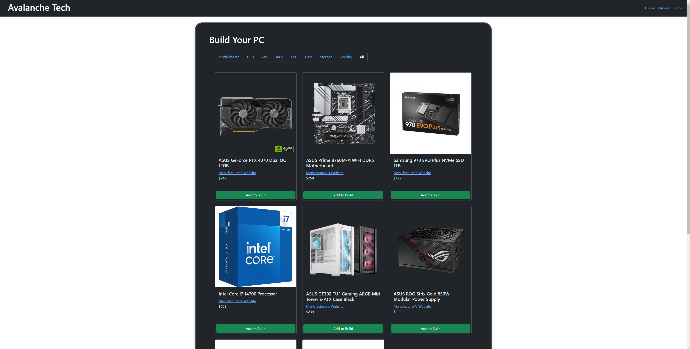

# Bootcamp Project 3 - Avalanche Tech: A custom PC build order website.
[](https://opensource.org/licenses/MIT)

## Description
This web application aims to allow users to create custom build orders for a Desktop Computer by selecting the parts they would like from a list supplied by the website.

The website will automatically update to restrict incompatible parts and will automatically calculate and display the total cost of the build to the user.

The user will have the option to see their current/prior orders and cancel/update them until the build starts.

The owner will have a private portal to show the currently placed orders and the details of the orders, along with profit and cost for each build.

## Table of Contents 
- [User Story](#user-story)
- [Acceptance Criteria](#acceptance-criteria)
- [Technologies](#technologies)
- [Testing](#testing)
- [Usage](#usage)
- [Screenshots/Video](<#screenshots--video-of-completed-challenge>)
- [Future Development](#future-development)
- [License](#license)
- [Credits](#credits)
- [Questions / How to Contribute](#questions--how-to-contribute)

## User Story
```

AS a small custom PC build business
I WANT a website where potential clients can easily make orders for builds
SO THAT I can easily track orders, profits and clients.

```

## Acceptance Criteria
```
Project Constraints:
Use the MERN stack to make a full-stack web application.
Have a polished UI.
Be responsive.
Be interactive (i.e., accept and respond to user input).
Include authentication (express-session and cookies).
Protect API keys and sensitive information with environment variables.
Have a clean repository that meets quality coding standards (file structure, naming conventions, follows best practices for class/id naming conventions, indentation, quality comments, etc.).
Have a quality README (with unique name, description, technologies used, screenshot, and link to deployed application).

Project Aims:
Allow users to create online orders for custom PC builds using Stripe.
Allow users to track the progress of orders.
Update parts list based on compaitibility with already-selected parts.
Track current and prior orders to BOTH users and the owner.
Protect ALL sensitive information - Passwords (Encrypted), addresses and Bank/Card details (never stored.)
Display total cost of cart including build price.
Display part costs to user when the user selects parts.
Have a portal for the owner/admin to add parts to the database.
```

## Technologies
 - MERN Stack - Main technlogies for building the application.
 - Stripe - For handling user payments.
 - Devmon - For development.
 - Concurrently - Primarily for development, handles running server and client at same time.
 - JWT - For user session information and authentication.
 - Bootstrap - For CSS/styling.
 - bcrypt - For all password/sensitive information encryption.

## Testing
No self tests exist for this application.

## Usage
To use the site, simply add items to your build, once you have a completed build (all categories are filled), then a checkout button will appear.
Click the checkout button, pay, and the build will be added to your orders.

## GitHub repository
You can find the GitHub repository [here.](https://github.com/JakebJackson/Face-Link)

## Deployed Application
The deployed application can be found [here.](https://avalanche-tech-c70de26ba11d.herokuapp.com)

## Screenshots / Video of Completed Challenge


## Future Development
I have a few features that I would like to add in the future:
 - Admin/Owner portal for dynamically adding new parts/updating and deleting old parts from the database in the client.
 - Modals for errors.
 - Better error catching and logging.
 - Order progress tracker for clients, that the Owner/Admin can update.
 - Better phone compaitibility for CSS.

## License
This project is licenced under the MIT licence.
    
## Questions / How to Contribute
If you have any questions or concerns, please open an issue and I will do my best to get back to you. You can view my other work on GitHub: [Jakeb Jackson](https://github.com/JakebJackson)

## Credits
Monash University Full Stack Coding Bootcamp.

---
